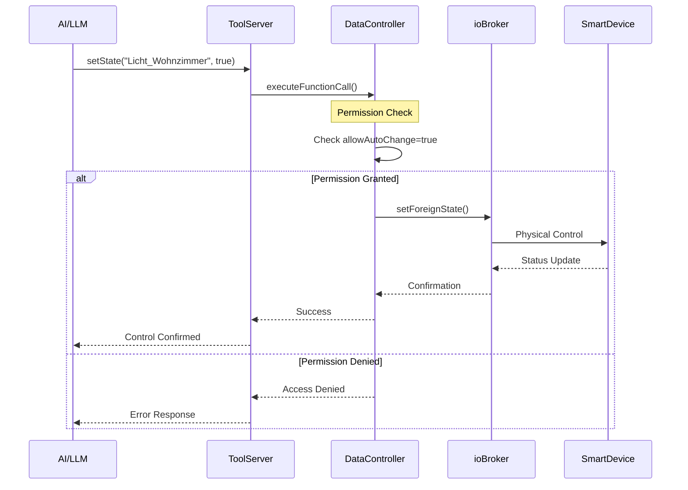

# 🏗️ **ioBroker.ollama - Architektur-Analyse**

## **📊 SYSTEM-ÜBERSICHT**

## **🔄 DATENFLUSS-DIAGRAMM**

### **1. Chat Request Flow:**

### **2. Smart Home Control Flow:**

### **3. Vector Database & RAG Flow:**

## **🔧 KOMPONENTEN-INTERAKTIONEN**

### **Core Components:**

1. **Main Adapter (main.js)**
   - **Rolle**: Zentrale Orchestrierung
   - **Abhängigkeiten**: Alle Module
   - **Verantwortlichkeiten**: 
     - Service-Initialisierung
     - State-Management
     - Error-Handling
     - Cleanup

2. **OllamaClient**
   - **Rolle**: LLM-Integration Manager
   - **Abhängigkeiten**: HttpClient, DatapointController
   - **Architektur**: OpenWebUI-First mit Ollama-Fallback
   - **Funktionen**:
     - Chat-Processing
     - Function-Calling
     - Progress-Monitoring

3. **ToolServer**
   - **Rolle**: OpenWebUI Tools API Provider
   - **Abhängigkeiten**: DatapointController, QdrantHelper
   - **Services**:
     - setState/getState Endpoints
     - RAG Query Endpoint
     - Chat Completions with Tool Integration

4. **DatapointController**
   - **Rolle**: Smart Home State Management
   - **Sicherheit**: Granulare Permissions (read vs write)
   - **Features**:
     - Type Conversion
     - Custom Boolean Values
     - Permission Management

5. **QdrantHelper**
   - **Rolle**: Vector Database Operations
   - **Features**:
     - Embedding Generation
     - Vector Storage
     - RAG Context Retrieval
     - Retention Policy Management

### **Support Components:**

6. **HttpClient**
   - **Rolle**: Centralized HTTP Management
   - **Features**:
     - Connection Pooling
     - Keep-Alive
     - Service-Specific Timeouts

7. **ConfigValidator**
   - **Rolle**: Configuration Safety
   - **Features**:
     - Early Validation
     - Port Conflict Detection
     - Dependency Verification

8. **HealthMonitor**
   - **Rolle**: System Monitoring
   - **Features**:
     - Multi-Service Health Checks
     - HTTP Endpoint for Monitoring
     - Periodic Status Updates

9. **LRUCache**
   - **Rolle**: Memory Management
   - **Features**:
     - State Change Deduplication
     - TTL Support
     - Memory Leak Prevention

## **🔐 SICHERHEITSMODELL**

### **Permission Layers:**
1. **Configuration Level**: `allowAutoChange` flag
2. **Controller Level**: Separate read/write permissions
3. **Adapter Level**: Namespace isolation
4. **API Level**: Request validation

### **Data Protection:**
1. **API Keys**: Encrypted storage in ioBroker
2. **State Access**: Controlled via DatapointController
3. **Network**: HTTPS support, timeout protection
4. **Memory**: LRU cache prevents memory leaks

## **📊 PERFORMANCE CHARAKTERISTIKA**

### **Timeouts & Limits:**
- **LLM Requests**: 20 minutes (1200s)
- **Embeddings**: 5 minutes (300s) 
- **RAG Queries**: 10 minutes (600s)
- **HTTP Default**: 30 seconds
- **Progress Monitoring**: 30-second intervals

### **Caching Strategy:**
- **State Changes**: LRU Cache (1000 items, 5min TTL)
- **HTTP Connections**: Keep-alive pooling
- **Vector DB**: Retention policy for data management

### **Scaling Considerations:**
- **Connection Pooling**: Max 10 sockets per service
- **Memory Management**: LRU cache + periodic cleanup
- **Retry Logic**: Built-in fallback mechanisms

## **🚨 IDENTIFIZIERTE RISIKEN**

### **High Priority:**
1. **Memory Leaks**: Bei großen RAG-Queries
2. **Security**: Unzureichende Input-Validierung
3. **Performance**: Blockierende Retention-Cleanup

### **Medium Priority:**
1. **Error Handling**: Fehlende Circuit-Breaker
2. **Monitoring**: Keine Request-Rate-Limits
3. **Configuration**: API-Key Exposure in Logs

### **Low Priority:**
1. **Code Duplication**: Mehrfache DataController-Updates
2. **Documentation**: Fehlende API-Dokumentation
3. **Testing**: Begrenzte Unit-Test-Abdeckung
